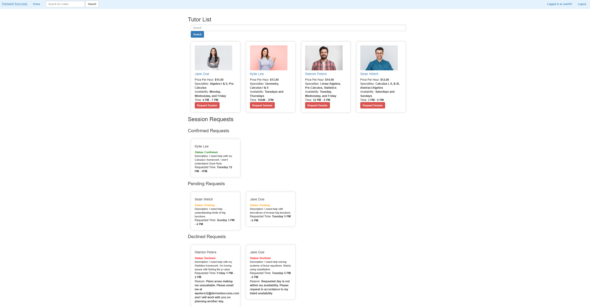
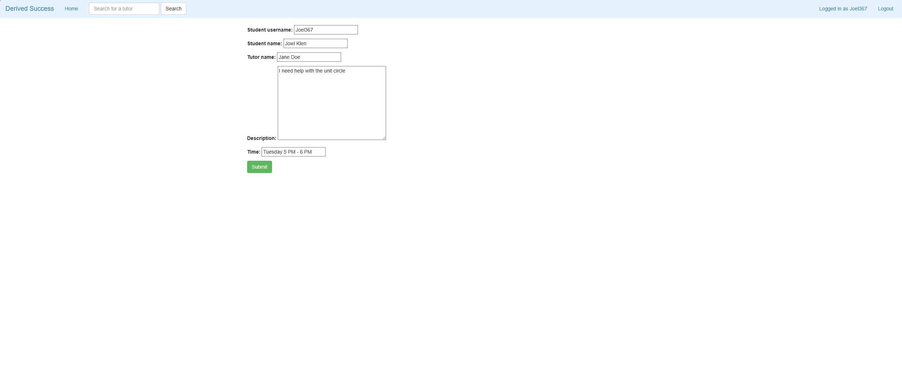
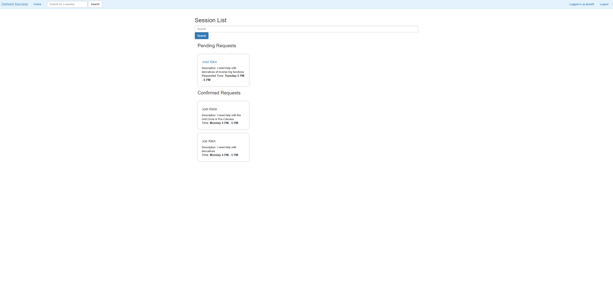

# Derived Success Tutoring Platform

A full-stack tutoring management web application built with Django that allows students to connect with tutors, request tutoring sessions, and manage appointments through a role-based system.

## Overview

Derived Success is a tutoring platform created as part of a web development project. Inspired by a fictional company originally developed during a cybersecurity assignment, the project evolved into a complete web application focused on connecting students with tutors and simplifying the tutoring request process.

The application demonstrates full-stack web development concepts including user authentication, database management, role-based access control, and dynamic content rendering using Django.

## Features

### Student Features

- Create an account and securely log in
- Browse available tutors
- View tutor specialties and availability
- Submit tutoring session requests
- Track tutoring requests and appointments

### Tutor Features

- View pending tutoring requests
- View accepted tutoring sessions
- Manage and update session requests
- Access tutor-specific functionality through role-based permissions

### Administrative Features

- User and session management
- Database-backed content management

## Technologies Used

### Backend

- Python
- Django

### Frontend

- HTML
- Bootstrap
- JavaScript
- jQuery

### Database

- SQLite

## Key Concepts Demonstrated

- Full-stack web application development
- User authentication and authorization
- Role-based access control
- Database design and management
- CRUD operations
- Dynamic web page rendering
- Form validation and processing
- MVC/MVT architectural patterns
- Version control with Git and GitHub

## Installation

### Clone the Repository

```bash
git clone https://github.com/JoelK659/Derived-Success.git
cd Derived-Success
```

### Create a Virtual Environment

```bash
python -m venv venv
```

### Activate the Virtual Environment

**Windows**

```bash
venv\Scripts\activate
```

**macOS/Linux**

```bash
source venv/bin/activate
```

### Install Dependencies

```bash
pip install -r requirements.txt
```

### Apply Database Migrations

```bash
python manage.py migrate
```

### Start the Development Server

```bash
python manage.py runserver
```

Open your browser and navigate to:

```text
http://127.0.0.1:8000/
```

## Project Goals

The goal of this project was to gain practical experience building a real-world web application using Django while implementing common software engineering concepts such as authentication, authorization, database interaction, and user workflow management.

## Future Enhancements

- Tutor ratings and reviews
- Email notifications for session updates
- Calendar integration
- Online meeting links
- Advanced tutor search and filtering
- Session history and reporting

## Screenshots

### Home Page



### Tutor Detail


### Session Request Form



### Tutor Dashboard



## Author

Developed by Joel Klein as part of a web development course project.
